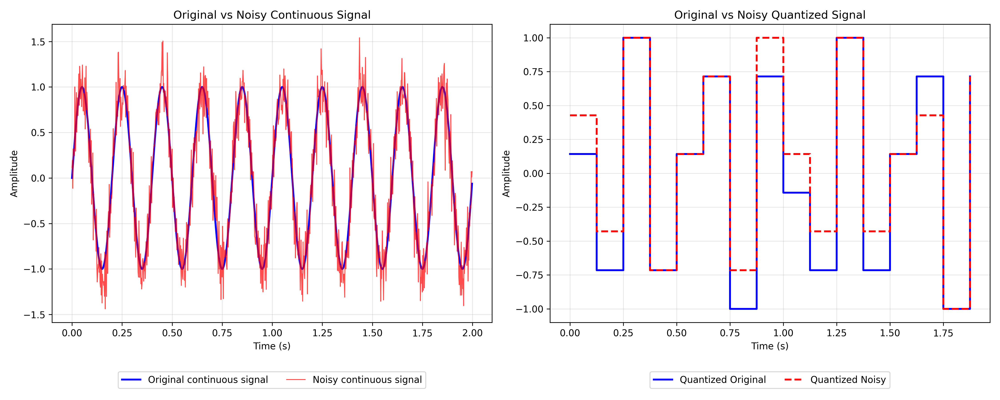

# Image Formation & Geometric Transformations

This repository contains solutions for CSC 391 Computer Vision course assignments focusing on image formation, geometric transformations, sampling, quantization, and noise analysis.

## Repository Structure

```
├── README.md    
├── image_formation/
│   ├── geometric_transform.py            # Exercise 1: Geometric Transformations
│   ├── lens_aperture_params.py           # Exercise 2: Thin Lens Law and F-Number Analysis
│   ├── sampling_quantization.py          # Exercise 3: Signal Sampling and Quantization
│   ├── error_noise_analysis.py           # Exercise 4: Noise and Error Analysis
│   ├── images/
│   │   ├── original_image.jpg            # Input image for transformations
│   │   └── transformed_image.jpg         # Target transformed image
│   └── Output/                          # Generated plots and results
│       ├── thin_lens_law.png
│       ├── real_lenses_aperture.png
│       ├── sampling_quantization.png
│       ├── continuous_vs_quantized_noise.png
│       └── geometric_transform.png
```

## Dependencies

```bash
# Install required packages
pip install numpy matplotlib opencv-python numpy

# Or using conda
conda install numpy matplotlib opencv numpy
``` 

## Exercise 1: Reverse Engineering 2D Transformations

**File**: `geometric_transform.py`

### Objective
Reverse engineer geometric transformations applied to an image by analyzing before/after image pairs and recreating the transformation.

### Features
- **OpenCV Integration**: Uses OpenCV for image reading and geometric transformations
- **Affine Transformation**: Implements 2D affine transformations using point correspondences
- **Transformation Analysis**: Automatically calculates and prints:
  - Translation components (tx, ty)
  - Scale factors (sx, sy)
  - Rotation angle in degrees
  - Shear/skew detection
- **Visual Comparison**: Displays original, target, and recreated images side-by-side

### Usage
```bash
python3 geometric_transform.py
```

### Output


### Brief Explanation
I have use affine transformation here which takes 3 co-ordiantes and map from to source to destination using a matrix operation. I focused on three geometric figures, rectangle, circle and hexagon and find the approximate co-ordinates of the center of them and then use brute force technieques to map it to the destination so that it looks like the given transformed image. This is the following analysis -

=== TRANSFORMATION ANALYSIS ===

Source points (original): <br>
  Point 1: (160, 160) <br>
  Point 2: (160, 1000) <br>
  Point 3: (1000, 180) <br>

Destination points (transformed): <br>
  Point 1: (450, 250) <br>
  Point 2: (750, 1100) <br>
  Point 3: (850, 500) <br>

Affine Transformation Matrix: <br>
[0.4677  0.3571  318.03] <br>
[0.2735  1.0119  44.33]

=== TRANSFORMATION COMPONENTS === <br>
Translation: (318.03, 44.33) pixels <br>
Scale factors: X=0.542, Y=1.073 <br>
Rotation angle: 30.32 degrees <br>

---

## Exercise 2: Thin Lens Law and F-Number Plots

**File**: `lens_aperture_params.py`

### Objective
Analyze camera lens optics by plotting thin lens law relationships and calculating aperture diameters for real-world lenses.

### Features
- **Thin Lens Law Visualization**: Plots image distance (zi) vs object distance (z0) for various focal lengths
- **F-Number Analysis**: Visualizes aperture diameter vs focal length relationships
- **Real Lens Calculations**: Computes aperture diameters for actual camera lenses

### Key Parameters
- **Focal lengths**: 3.0, 9.0, 50.0, 200.0 mm (including iPhone and DSLR ranges)
- **Object distance range**: [1.1f, 10⁴] mm with 4 points per mm sampling
- **Real lenses analyzed**: 24mm f/1.4, 50mm f/1.8, 70-200mm f/2.8, 400mm f/2.8, 600mm f/4.0

### Formulas Implemented
- **Thin lens equation**: `1/zi + 1/z0 = 1/f`
- **Aperture diameter**: `D = f / N` (where N is f-number)

### Usage
```bash
python3 lens_aperture_params.py
```

### Output


### Brief Explanation
The figure Aperture vs Focal length shows that by increasing the focal length we need to increase the aperture diameter too for a fixed f-number. <br>
**Question**: "What should the aperture diameter be for each lens in order to achieve their stated maximum f-number?"
**Answer**: <br>
Max aperture diameters D = f / N:
| Lens                      | Focal Length (f) | Max f-number (N) | Aperture Diameter (D = f / N) |
|---------------------------|------------------|------------------|-------------------------------|
| 24 mm f/1.4               | 24 mm            | 1.4              | 17.14 mm                      |
| 50 mm f/1.8               | 50 mm            | 1.8              | 27.78 mm                      |
| 70–200 mm f/2.8 (70 mm)   | 70 mm            | 2.8              | 25.00 mm                      |
| 70–200 mm f/2.8 (200 mm)  | 200 mm           | 2.8              | 71.43 mm                      |
| 400 mm f/2.8              | 400 mm           | 2.8              | 142.86 mm                     |
| 600 mm f/4.0              | 600 mm           | 4.0              | 150.00 mm                     |
---

## Exercise 3: Sampling and Quantization

**File**: `sampling_quantization.py`

### Objective
Explore digital signal processing fundamentals by converting continuous signals to digital through sampling and quantization.

### Features
- **Signal Generation**: Creates sinusoidal signals with configurable frequency
- **Nyquist Analysis**: Automatically analyzes sampling rate vs Nyquist frequency
- **Quantization**: Implements n-bit quantization with configurable bit depth
- **Visualization**: Plots continuous vs quantized signals with step visualization

### Global Parameters
```python
signal_freq = 5.0    # Signal frequency in Hz
duration = 2.0       # Signal duration in seconds  
sampling_freq = 8.0  # Sampling frequency in Hz
num_bits = 3         # Quantization bits (8 levels: 0-7)
min_signal = -1.0    # Minimum signal amplitude
max_signal = 1.0     # Maximum signal amplitude
```

### Key Functions
- `original_signal(t)`: Generates sin(2πft) waveform
- `sample_times(duration, fs)`: Creates sampling time points
- `quantize(samples, bits, min, max)`: Quantizes signal to n-bit resolution

### Usage
```bash
python3 sampling_quantization.py
```


### Output


**Question**: 
What do you think a reasonable sampling frequency should be to capture the true shape of the
signal? What should be done to minimize error? <br>

**Answer**: 
The given signal frequency is 5 Hz and the sampling_freq is 8 Hz. According to Nyquist Theorem to capture the true shape of the signal the minimum sampling frequency should be greater or equal to 2x of signal_frequency that means the sampling frequency atleast should be 10 Hz which in this case is 8 Hz and so this can not capture the true shape of the signal. To minimize the error, we can use something like sample above nyquist or apply anti-alias low-pass filter. 

---

## Exercise 4: Noise and Error Analysis

**File**: `error_noise_analysis.py`

### Objective
Study the effects of Gaussian noise on digital signals and quantify error using standard metrics.

### Features
- **Gaussian Noise Modeling**: Adds realistic thermal/sensor noise to signals
- **Dual Visualization**: Side-by-side comparison of:
  - Continuous signals (original vs noisy)
  - Quantized signals (clean vs noisy quantization)
- **Error Metrics**: Calculates and reports:
  - **MSE** (Mean Squared Error)
  - **RMSE** (Root Mean Squared Error)  
  - **PSNR** (Peak Signal-to-Noise Ratio) in dB

### Noise Parameters
```python
mean = 0.0          # Gaussian noise mean
std_dev = 0.1       # Noise standard deviation (10% of signal magnitude)
```

### Error Formulas
- **MSE**: `(1/n) * Σ(original - noisy)²`
- **RMSE**: `√MSE`
- **PSNR**: `10 * log₁₀(|max_signal|² / MSE)` dB

### Usage
```bash
python3 error_noise_analysis.py
```
### Output


### Brief Explanation
This figure shows two suplots. The left subplot shows the original continous signal and noisy signal which reflects the Gaussian Noise. Right plot shows the quantization of the both these signals.

**Question**: Report of the error <br>
**Answer**
| Metric | Value      |
|--------|------------|
| MSE    | 0.040816   |
| RMSE   | 0.202031   |
| PSNR   | 13.89   |
